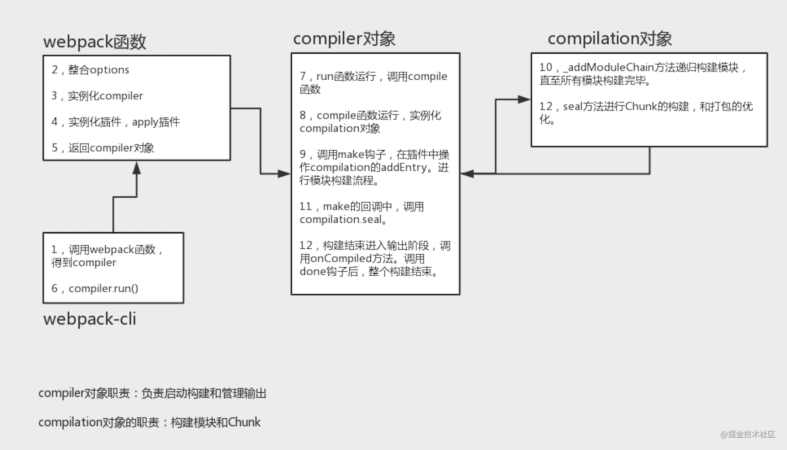
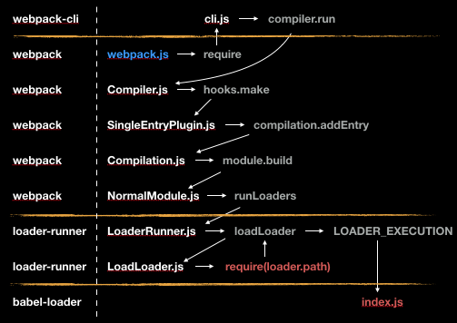

# Webpack 源码整体结构




## 源码调试(Vscode)
- 点击`运行和调试`
- 选择`Node.js`
- 在项目中`webpack`配置的地方可以打断点了

> ## 1.webpack
>
> ::: details 调用 webpack 函数，option 初始化，创建 compiler、compilation 对象、初始化 webpack 参数,得到 compiler,实例化 WebpackCLI 时,解析 node_modules/webpack/lib/webpack.js
>
> ```js{5,6,8-10,16}
> const webpack = (options, callback) => {
>   let compiler
>   if (Array.isArray(options)) {
>   } else if (typeof options === "object") {
>     options = new WebpackOptionsDefaulter().process(options)  // 用户设置的配置和默认配置合并
>     compiler = new Compiler(options.context) // Compiler 阶段
>     compiler.options = options
>     new NodeEnvironmentPlugin({  // 配置全局api插件
>       infrastructureLogging: options.infrastructureLogging,
>     }).apply(compiler)
>     if (options.plugins && Array.isArray(options.plugins)) {
>       for (const plugin of options.plugins) {
>         if (typeof plugin === "function") {
>           plugin.call(compiler, compiler)
>         } else {
>           plugin.apply(compiler) // 执行我们在配置文件中配置的所有插件
>         }
>       }
>     }
>     compiler.hooks.environment.call()
>     compiler.hooks.afterEnvironment.call()
>     //开启默认的所有插件
>     compiler.options = new WebpackOptionsApply().process(options, compiler)
>   }
>   return compiler
> }
> ```
>
> :::
>
> ### 2.整合 options
>
> > ```js
> > options = new WebpackOptionsDefaulter().process(options)
> > ```
> >
> > ### 3.实例化 compiler
> >
> > ```js
> > compiler = new Compiler(options.context)
> > ```
> >
> > ### 4.实例化插件，apply 插件
> >
> > ```js
> > plugin.apply(compiler)
> > ```
> >
> > ### 5.返回 compiler 对象
> >
> > ::: details 代码
> >
> > ```js
> > compiler.hooks.environment.call()
> > compiler.hooks.afterEnvironment.call()
> > //开启默认的所有插件
> > compiler.options = new WebpackOptionsApply().process(options, compiler)
> > ```
> >
> > :::
>
> ## 6.compiler.run()
>
> ::: details 解析 `node_modules/webpack-cli/lib/bootstrap.js`
>
> ```js
> const runCLI = async (args, originalModuleCompile) => {
>  ...
>  await cli.run(args)
>  ...
> }
> ```
>
> :::
>
> ## 7.compile
>
> ::: details 开始编译，主要是加载入口文件，添加入口 module，run 函数运行，调用 compile 函数
>
> ```js{11,12,14}
> class Compiler extends Tapable {
>  run(callback) {
>      ...
>    this.hooks.beforeRun.callAsync(this, (err) => {
>      this.compile(onCompiled)
>    })
>  }
>  compile(callback) {//编译
>    const params = this.newCompilationParams()//创建编译器的参数
>    this.hooks.beforeCompile.callAsync(params, (err) => {
>      const compilation = this.newCompilation(params) //创建一个编译器
>      this.hooks.make.callAsync(compilation, (err) => { //执行前面## EntryPlugin.js注册的make钩子函数并把编译器传递给插件
>        compilation.finish((err) => {
>          compilation.seal((err) => {
>            ...
>          })
>        })
>      })
>    })
>  }
> }
> ```
>
> :::
>
> > ### 8.实例化 compilation 对象
> >
> > ::: details 代码
> >
> > ```js{2}
> > newCompilation(params) {
> >  const compilation = this.createCompilation();
> >  compilation.fileTimestamps = this.fileTimestamps;
> >  compilation.contextTimestamps = this.contextTimestamps;
> >  compilation.name = this.name;
> >  compilation.records = this.records;
> >  compilation.compilationDependencies = params.compilationDependencies;
> >  this.hooks.thisCompilation.call(compilation, params);
> >  this.hooks.compilation.call(compilation, params);
> >  return compilation;
> > }
> > ```
> >
> > :::
> >
> > ### 9.make
> >
> > ::: details 调用 make 钩子，在插件中操作 compilation 的 addEntry。进行模块构建流程。
> >
> > ```js
> > createCompilation() {
> > 	return new Compilation(this);
> > }
> > ```
> >
> > ```js{4}
> > addEntry(context, entry, name, callback) {
> >  this.hooks.addEntry.call(entry, name);
> >  ...
> >  this._addModuleChain(
> >    context,
> >    entry,
> >    module => {
> >      this.entries.push(module);
> >    },
> >    (err, module) => {
> >     ...
> >      this.hooks.succeedEntry.call(entry, name, module);
> >      return callback(null, module);
> >    }
> >  );
> > }
> > ```
> >
> > :::
> >
> > > #### 10.`_addModuleChain`
> > >
> > > ::: details `_addModuleChain` 方法递归构建模块，直至所有模块构建完毕。
> > >
> > > ```js{5}
> > > _addModuleChain(context, dependency, onModule, callback) {
> > > 	...
> > > 	const moduleFactory = this.dependencyFactories.get(Dep);
> > > 	this.semaphore.acquire(() => {
> > > 		moduleFactory.create(
> > > 			{
> > > 				contextInfo: {
> > > 					issuer: "",
> > > 					compiler: this.compiler.name
> > > 				},
> > > 				context: context,
> > > 				dependencies: [dependency]
> > > 			},
> > > 			(err, module) => {
> > > 				let afterFactory;
> > > 				if (currentProfile) {
> > > 					afterFactory = Date.now();
> > > 					currentProfile.factory = afterFactory - start;
> > > 				}
> > > 				const addModuleResult = this.addModule(module);
> > > 				module = addModuleResult.module;
> > > 				onModule(module);
> > > 				...
> > > 				if (addModuleResult.build) {
> > > 					this.buildModule(module, false, null, null, err => {
> > > 						...
> > > 						this.semaphore.release();
> > > 						afterBuild();
> > > 					});
> > > 				} else {
> > > 					this.semaphore.release();
> > > 					this.waitForBuildingFinished(module, afterBuild);
> > > 				}
> > > 			}
> > > 		);
> > > 	});
> > > }
> > > ```
> > >
> > > :::
> >
> > ### 11.seal
> >
> > ::: details make 的回调中，调用 compilation.seal。
> >
> > ```js
> > compilation.seal((err) => {
> >   if (err) return callback(err)
> >   this.hooks.afterCompile.callAsync(compilation, (err) => {
> >     if (err) return callback(err)
> >     return callback(null, compilation)
> >   })
> > })
> > ```
> >
> > :::
> >
> > #### 12.Chunk
> >
> > ::: details 调用seal 方法进行 Chunk 的构建，和大包优化。
> >
> > ```js
> > seal(callback) {
> > 	this.hooks.seal.call();
> > 	while (
> > 		this.hooks.optimizeDependenciesBasic.call(this.modules) ||
> > 		this.hooks.optimizeDependencies.call(this.modules) ||
> > 		this.hooks.optimizeDependenciesAdvanced.call(this.modules)
> > 	) {
> > 		/* empty */
> > 	}
> > 	this.hooks.afterOptimizeDependencies.call(this.modules);
> > 	this.hooks.beforeChunks.call();
> > 	for (const preparedEntrypoint of this._preparedEntrypoints) {
> > 		const module = preparedEntrypoint.module;
> > 		const name = preparedEntrypoint.name;
> > 		const chunk = this.addChunk(name);
> > 		const entrypoint = new Entrypoint(name);
> > 		entrypoint.setRuntimeChunk(chunk);
> > 		entrypoint.addOrigin(null, name, preparedEntrypoint.request);
> > 		this.namedChunkGroups.set(name, entrypoint);
> > 		this.entrypoints.set(name, entrypoint);
> > 		this.chunkGroups.push(entrypoint);
> > 		GraphHelpers.connectChunkGroupAndChunk(entrypoint, chunk);
> > 		GraphHelpers.connectChunkAndModule(chunk, module);
> > 		chunk.entryModule = module;
> > 		chunk.name = name;
> > 		this.assignDepth(module);
> > 	}
> > 	buildChunkGraph(
> > 		this,
> > 		/** @type {Entrypoint[]} */ (this.chunkGroups.slice())
> > 	);
> > 	this.sortModules(this.modules);
> > 	this.hooks.afterChunks.call(this.chunks);
> > 	this.hooks.optimize.call();
> > 	while (
> > 		this.hooks.optimizeModulesBasic.call(this.modules) ||
> > 		this.hooks.optimizeModules.call(this.modules) ||
> > 		this.hooks.optimizeModulesAdvanced.call(this.modules)
> > 	) {
> > 		/* empty */
> > 	}
> > 	this.hooks.afterOptimizeModules.call(this.modules);
> > 	while (
> > 		this.hooks.optimizeChunksBasic.call(this.chunks, this.chunkGroups) ||
> > 		this.hooks.optimizeChunks.call(this.chunks, this.chunkGroups) ||
> > 		this.hooks.optimizeChunksAdvanced.call(this.chunks, this.chunkGroups)
> > 	) {
> > 		/* empty */
> > 	}
> > 	this.hooks.afterOptimizeChunks.call(this.chunks, this.chunkGroups);
> > 	this.hooks.optimizeTree.callAsync(this.chunks, this.modules, err => {
> > 		if (err) {
> > 			return callback(err);
> > 		}
> > 		this.hooks.afterOptimizeTree.call(this.chunks, this.modules);
> > 		while (
> > 			this.hooks.optimizeChunkModulesBasic.call(this.chunks, this.modules) ||
> > 			this.hooks.optimizeChunkModules.call(this.chunks, this.modules) ||
> > 			this.hooks.optimizeChunkModulesAdvanced.call(this.chunks, this.modules)
> > 		) {
> > 			/* empty */
> > 		}
> > 		this.hooks.afterOptimizeChunkModules.call(this.chunks, this.modules);
> > 		const shouldRecord = this.hooks.shouldRecord.call() !== false;
> > 		this.hooks.reviveModules.call(this.modules, this.records);
> > 		this.hooks.optimizeModuleOrder.call(this.modules);
> > 		this.hooks.advancedOptimizeModuleOrder.call(this.modules);
> > 		this.hooks.beforeModuleIds.call(this.modules);
> > 		this.hooks.moduleIds.call(this.modules);
> > 		this.applyModuleIds();
> > 		this.hooks.optimizeModuleIds.call(this.modules);
> > 		this.hooks.afterOptimizeModuleIds.call(this.modules);
> > 		this.sortItemsWithModuleIds();
> > 		this.hooks.reviveChunks.call(this.chunks, this.records);
> > 		this.hooks.optimizeChunkOrder.call(this.chunks);
> > 		this.hooks.beforeChunkIds.call(this.chunks);
> > 		this.applyChunkIds();
> > 		this.hooks.optimizeChunkIds.call(this.chunks);
> > 		this.hooks.afterOptimizeChunkIds.call(this.chunks);
> > 		this.sortItemsWithChunkIds();
> > 		if (shouldRecord) {
> > 			this.hooks.recordModules.call(this.modules, this.records);
> > 			this.hooks.recordChunks.call(this.chunks, this.records);
> > 		}
> > 		this.hooks.beforeHash.call();
> > 		this.createHash();
> > 		this.hooks.afterHash.call();
> > 		if (shouldRecord) {
> > 			this.hooks.recordHash.call(this.records);
> > 		}
> > 		this.hooks.beforeModuleAssets.call();
> > 		this.createModuleAssets();
> > 		if (this.hooks.shouldGenerateChunkAssets.call() !== false) {
> > 			this.hooks.beforeChunkAssets.call();
> > 			this.createChunkAssets();
> > 		}
> > 		this.hooks.additionalChunkAssets.call(this.chunks);
> > 		this.summarizeDependencies();
> > 		if (shouldRecord) {
> > 			this.hooks.record.call(this, this.records);
> > 		}
> > 		this.hooks.additionalAssets.callAsync(err => {
> > 			if (err) {
> > 				return callback(err);
> > 			}
> > 			this.hooks.optimizeChunkAssets.callAsync(this.chunks, err => {
> > 				if (err) {
> > 					return callback(err);
> > 				}
> > 				this.hooks.afterOptimizeChunkAssets.call(this.chunks);
> > 				this.hooks.optimizeAssets.callAsync(this.assets, err => {
> > 					if (err) {
> > 						return callback(err);
> > 					}
> > 					this.hooks.afterOptimizeAssets.call(this.assets);
> > 					if (this.hooks.needAdditionalSeal.call()) {
> > 						this.unseal();
> > 						return this.seal(callback);
> > 					}
> > 					return this.hooks.afterSeal.callAsync(callback);
> > 				});
> > 			});
> > 		});
> > 	});
> > }
> > ```
> >
> > :::
> >
> > ### 13.onCompiled
> >
> > ::: details 构建结束进入输出阶段，调用 onCompiled 方法。调用 done 钩子后，整个构建结束。
> >
> > ```js
> > const onCompiled = (err, compilation) => {
> >   if (err) return finalCallback(err)
> >
> >   if (this.hooks.shouldEmit.call(compilation) === false) {
> >     const stats = new Stats(compilation)
> >     stats.startTime = startTime
> >     stats.endTime = Date.now()
> >     this.hooks.done.callAsync(stats, (err) => {
> >       if (err) return finalCallback(err)
> >       return finalCallback(null, stats)
> >     })
> >     return
> >   }
> >   //执行打包操作
> >   this.emitAssets(compilation, (err) => {
> >     if (err) return finalCallback(err)
> >     if (compilation.hooks.needAdditionalPass.call()) {
> >       compilation.needAdditionalPass = true
> >       const stats = new Stats(compilation)
> >       stats.startTime = startTime
> >       stats.endTime = Date.now()
> >       this.hooks.done.callAsync(stats, (err) => {
> >         if (err) return finalCallback(err)
> >         this.hooks.additionalPass.callAsync((err) => {
> >           if (err) return finalCallback(err)
> >           this.compile(onCompiled)
> >         })
> >       })
> >       return
> >     }
> >     this.emitRecords((err) => {
> >       if (err) return finalCallback(err)
> >       const stats = new Stats(compilation)
> >       stats.startTime = startTime
> >       stats.endTime = Date.now()
> >       this.hooks.done.callAsync(stats, (err) => {
> >         if (err) return finalCallback(err)
> >         return finalCallback(null, stats)
> >       })
> >     })
> >   })
> > }
> > ```
> >
> > :::

# 工作流程

抛开复杂的 loader 和 plugin 机制，webpack 本质上就是一个 JS Module Bundler，用于将多个代码模块进行打包，所以我们先撇开 webpack 错综复杂的整体实现，来看一下一个相对简单的 JS Module Bunlder 的基础工作流程是怎么样的，在了解了 bundler 如何工作的基础上，再进一步去整理 webpack 整个流程，将 loader 和 plugin 的机制弄明白。

> 以下内容将 module bundler 简称为 bundler。

## 1.bundler 的基础流程

首先，bundler 从一个构建入口出发，解析代码，分析出代码模块依赖关系，然后将依赖的代码模块组合在一起，在 JavaScript bundler 中，还需要提供一些胶水代码让多个代码模块可以协同工作，相互引用。下边会举一些简单的例子来说明一下这几个关键的部分是怎么工作的。

首先是解析代码，分析依赖关系，对于 [ES6 Module](http://es6.ruanyifeng.com/#docs/module) 以及 [CommonJS Modules](http://www.commonjs.org/specs/modules/1.0/) 语法定义的模块，例如这样的代码：

```js
// entry.js
import { bar } from './bar.js'; // 依赖 ./bar.js 模块

// bar.js
const foo = require('./foo.js'); // 依赖 ./foo.js 模块
```

bundler 需要从这个入口代码（第一段）中解析出依赖 bar.js，然后再读取 bar.js 这个代码文件，解析出依赖 foo.js 代码文件，继续解析其依赖，递归下去，直至没有更多的依赖模块，最终形成一颗模块依赖树。

> 至于如何从 JavaScript 代码中解析出这些依赖，作者写过一篇文章，可以参考下：[使用 Acorn 来解析 JavaScript](https://juejin.im/post/582425402e958a129926fcb4)。

如果 foo.js 文件没有依赖其他的模块的话，那么这个简单例子的依赖树也就相对简单：`entry.js -> bar.js -> foo.js`，当然，日常开发中遇见的一般都是相当复杂的代码模块依赖关系。

分析出依赖关系后，bunlder 需要将依赖关系中涉及的所有文件组合到一起，但由于依赖代码的执行是有先后顺序以及会引用模块内部不同的内容，不能简单地将代码拼接到一起。webpack 会利用 JavaScript Function 的特性提供一些代码来将各个模块整合到一起，即是将每一个模块包装成一个 JS Function，提供一个引用依赖模块的方法，如下面例子中的 `__webpack__require__`，这样做，既可以避免变量相互干扰，又能够有效控制执行顺序，简单的代码例子如下：

```js
// 分别将各个依赖模块的代码用 modules 的方式组织起来打包成一个文件
// entry.js
modules['./entry.js'] = function() {
  const { bar } = __webpack__require__('./bar.js')
}

// bar.js
modules['./bar.js'] = function() {
  const foo = __webpack__require__('./foo.js')
};

// foo.js
modules['./foo.js'] = function() {
  // ...
}

// 已经执行的代码模块结果会保存在这里
const installedModules = {}

function __webpack__require__(id) {
  // ...
  // 如果 installedModules 中有就直接获取
  // 没有的话从 modules 中获取 function 然后执行，将结果缓存在 installedModules 中然后返回结果
}
```

这只是 webpack 的实现方式的简单例子，[rollup](https://rollupjs.org/guide/en) 有另外的实现方式，并且笔者个人觉得 rollup 的实现方式比 webpack 要更加优秀一些，rollup 可以让你构建出来的代码量更少一点，有兴趣的同学可以看看这个文章：[Webpack and Rollup: the same but different](https://medium.com/webpack/webpack-and-rollup-the-same-but-different-a41ad427058c)，也可以使用 [rollup](https://rollupjs.org/guide/en) 来构建一个简单的例子，看看结果是什么样子的。

我们在介绍 bundler 的基础流程时，把各个部分的实现细节简化了，这有利于我们从整体的角度去看清楚整个轮廓，至于某一部分的具体实现，例如解析代码依赖，模块依赖关系管理，胶水代码的生成等，深入细节的话会比较复杂，这里不再作相关的展开。

## 2.webpack 的结构

webpack 需要强大的扩展性，尤其是插件实现这一块，webpack 利用了 [tapable](https://github.com/webpack/tapable) 这个库（其实也是 webpack 作者开发的库）来协助实现对于整个构建流程各个步骤的控制。

关于这个库更多的使用内容可以去查看官方的文档：[tapable](https://github.com/webpack/tapable)，使用上并不算十分复杂，最主要的功能就是用来添加各种各样的钩子方法（即 Hook）。

webpack 基于 tapable 定义了主要构建流程后，使用 tapable 这个库添加了各种各样的钩子方法来将 webpack 扩展至功能十分丰富，同时对外提供了相对强大的扩展性，即 plugin 的机制。

在这个基础上，我们来了解一下 webpack 工作的主要流程和其中几个重要的概念。

- Compiler，webpack 的运行入口，实例化时定义 webpack 构建主要流程，同时创建构建时使用的核心对象 compilation
- Compilation，由 Compiler 实例化，存储构建过程中各流程使用到的数据，用于控制这些数据的变化
- Chunk，即用于表示 chunk 的类，对于构建时需要的 chunk 对象由 Compilation 创建后保存管理
- Module，用于表示代码模块的类，衍生出很多子类用于处理不同的情况，关于代码模块的所有信息都会存在 Module 实例中，例如 `dependencies` 记录代码模块的依赖等
- Parser，其中相对复杂的一个部分，基于 [acorn](https://github.com/acornjs/acorn) 来分析 AST 语法树，解析出代码模块的依赖
- Dependency，解析时用于保存代码模块对应的依赖使用的对象
- Template，生成最终代码要使用到的代码模板，像上述提到的胶水代码就是用对应的 Template 来生成

> 官方对于 Compiler 和 Compilation 的定义是：
>
> **compiler** 对象代表了完整的 webpack 环境配置。这个对象在启动 webpack 时被一次性建立，并配置好所有可操作的设置，包括 options，loader 和 plugin。当在 webpack 环境中应用一个插件时，插件将收到此 compiler 对象的引用。可以使用它来访问 webpack 的主环境。
>
> **compilation** 对象代表了一次资源版本构建。当运行 webpack 开发环境中间件时，每当检测到一个文件变化，就会创建一个新的 compilation，从而生成一组新的编译资源。一个 compilation 对象表现了当前的模块资源、编译生成资源、变化的文件、以及被跟踪依赖的状态信息。compilation 对象也提供了很多关键步骤的回调，以供插件做自定义处理时选择使用。

上述是 webpack 源码实现中比较重要的几个部分，webpack 运行的大概工作流程是这样的：

```js
创建 Compiler ->
调用 compiler.run 开始构建 ->
创建 Compilation ->
基于配置开始创建 Chunk ->
使用 Parser 从 Chunk 开始解析依赖 ->
使用 Module 和 Dependency 管理代码模块相互关系 ->
使用 Template 基于 Compilation 的数据生成结果代码
```

上述只是笔者理解中的大概流程，细节相对复杂，一方面是技术实现的细节有一定复杂度，另一方面是实现的功能逻辑上也有一定复杂度，深入介绍的话，篇幅会很长，并且可能效果不理想，当我们还没到了要去实现具体功能的时候，无须关注那么具体的实现细节，只需要站在更高的层面去分析整体的流程。

有兴趣探究某一部分实现细节的同学，可以查阅 webpack 源码，从 webpack 基础流程入手：[Compiler Hooks](https://github.com/webpack/webpack/blob/master/lib/Compiler.js#L29)。

> 这里提供的是 4.x 版本的源码 master 分支的链接地址，webpack 的源码相对难懂，如果是想要学习 bundler 的整个工作流程，可以考虑看阅读 [rollup](https://github.com/rollup/rollup) 的源码，可读性相对会好很多。

## 3.从源码中探索 webpack

webpack 主要的构建处理方法都在 `Compilation` 中，我们要了解 loader 和 plugin 的机制，就要深入 `Compilation` 这一部分的内容。

Compilation 的实现也是比较复杂的，`lib/Compilation.js` 单个文件代码就有近 2000 行之多，我们挑关键的几个部分来介绍一下。

### 3.1 addEntry 和 \_addModuleChain

`addEntry` 这个方法顾名思义，用于把配置的入口加入到构建的任务中去，当解析好 webpack 配置，准备好开始构建时，便会执行 `addEntry` 方法，而 `addEntry` 会调用 `_addModuleChain` 来为入口文件（入口文件这个时候等同于第一个依赖）创建一个对应的 `Module` 实例。

`_addModuleChain` 方法会根据入口文件这第一个依赖的类型创建一个 `moduleFactory`，然后再使用这个 `moduleFactory` 给入口文件创建一个 `Module` 实例，这个 `Module` 实例用来管理后续这个入口构建的相关数据信息，关于 `Module` 类的具体实现可以参考这个源码：[lib/Module.js](https://github.com/webpack/webpack/blob/master/lib/Module.js)，这个是个基础类，大部分我们构建时使用的代码模块的 `Module` 实例是 [lib/NormalModule.js](https://github.com/webpack/webpack/blob/master/lib/NormalModule.js) 这个类创建的。

我们介绍 `addEntry` 主要是为了寻找整个构建的起点，让这一切有迹可循，后续的深入可以从这个点出发。

### 3.2 buildModule

当一个 `Module` 实例被创建后，比较重要的一步是执行 `compilation.buildModule` 这个方法，这个方法主要会调用 `Module` 实例的 `build` 方法，这个方法主要就是创建 `Module` 实例需要的一些东西，对我们梳理流程来说，这里边最重要的部分就是调用自身的 [runLoaders](https://github.com/webpack/webpack/blob/master/lib/NormalModule.js#L218) 方法。

`runLoaders` 这个方法是 webpack 依赖的这个类库实现的：[loader-runner](https://github.com/webpack/loader-runner)，这个方法也比较容易理解，就是执行对应的 loaders，将代码源码内容一一交由配置中指定的 loader 处理后，再把处理的结果保存起来。

我们之前介绍过，webpack 的 loader 就是转换器，loader 就是在这个时候发挥作用的，至于 loader 执行的细节，有兴趣深入的同学可以去了解 [loader-runner](https://github.com/webpack/loader-runner) 的实现。

上述提到的 `Module` 实例的 `build` 方法在执行完对应的 loader，处理完模块代码自身的转换后，还有相当重要的一步是调用 [Parser](https://github.com/webpack/webpack/blob/master/lib/Parser.js) 的实例来解析自身依赖的模块，解析后的结果存放在 `module.dependencies` 中，首先保存的是依赖的路径，后续会经由 `compilation.processModuleDependencies` 方法，再来处理各个依赖模块，递归地去建立整个依赖关系树。

### 3.3 Compilation 的钩子

我们前边提到了 webpack 会使用 [tapable](https://github.com/webpack/tapable) 给整个构建流程中的各个步骤定义钩子，用于注册事件，然后在特定的步骤执行时触发相应的事件，注册的事件函数便可以调整构建时的上下文数据，或者做额外的处理工作，这就是 webpack 的 plugin 机制。

在 webpack 执行入口处 [lib/webpack.js](https://github.com/webpack/webpack/blob/master/lib/webpack.js#L35) 有这么一段代码：

```js
if (options.plugins && Array.isArray(options.plugins)) {
	for (const plugin of options.plugins) {
		plugin.apply(compiler); // 调用每一个 plugin 的 apply 方法，把 compiler 实例传递过去
	}
}
```

这个 plugin 的 `apply` 方法就是用来给 `compiler` 实例注册事件钩子函数的，而 `compiler` 的一些事件钩子中可以获得 `compilation` 实例的引用，通过引用又可以给 `compilation` 实例注册事件函数，以此类推，便可以将 plugin 的能力覆盖到整个 webpack 构建过程。

而关于这些事件函数的名称和定义可以查看官方的文档：[compiler 的事件钩子](https://doc.webpack-china.org/api/compiler/#%E4%BA%8B%E4%BB%B6%E9%92%A9%E5%AD%90) 和 [compilation 的事件钩子](https://doc.webpack-china.org/api/compilation/)。

后续的 15 小节会介绍如何编写 webpack plugin，可以将两部分的内容结合一下，来帮助理解 webpack plugin 的执行机制。

### 3.4 产出构建结果

最后还有一个部分，即用 `Template` 产出最终构建结果的代码内容，这一部分不作详细介绍了，仅留下一些线索，供有兴趣继续深入的同学使用：

- `Template` 基础类：[lib/Template.js](https://github.com/webpack/webpack/blob/master/lib/Template.js)
- 常用的主要 `Template` 类：[lib/MainTemplate.js](https://github.com/webpack/webpack/blob/master/lib/MainTemplate.js)
- Compilation 中产出构建结果的代码：[compilation.createChunkAssets](https://github.com/webpack/webpack/blob/master/lib/Compilation.js#L1722)

