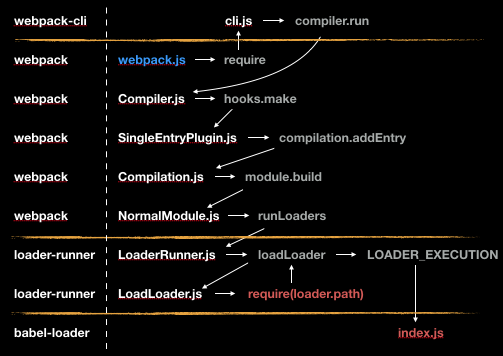

# Webpack 源码解析




## 源码调试(Vscode)

- 点击`运行和调试`
- 选择`Node.js`
- 在项目中`webpack`配置的地方可以打断点了

## 1.首次运行

### 1.1 vue-cli-service

### 1.2 webpack

调用 webpack 函数，option 初始化，创建 compiler、compilation 对象、初始化 webpack 参数,得到 compiler,实例化 WebpackCLI 时,解析 node_modules/webpack/lib/webpack.js

```js{5,6,8-10,16}
const webpack = (options, callback) ={
  let compiler
  if (Array.isArray(options)) {
  } else if (typeof options === "object") {
    options = new WebpackOptionsDefaulter().process(options)  // 用户设置的配置和默认配置合并
    compiler = new Compiler(options.context) // Compiler 阶段
    compiler.options = options
    new NodeEnvironmentPlugin({  // 配置全局api插件
      infrastructureLogging: options.infrastructureLogging,
    }).apply(compiler)
    if (options.plugins && Array.isArray(options.plugins)) {
      for (const plugin of options.plugins) {
        if (typeof plugin === "function") {
          plugin.call(compiler, compiler)
        } else {
          plugin.apply(compiler) // 执行我们在配置文件中配置的所有插件
        }
      }
    }
    compiler.hooks.environment.call()
    compiler.hooks.afterEnvironment.call()
    //开启默认的所有插件
    compiler.options = new WebpackOptionsApply().process(options, compiler)
  }
  return compiler
}
```

#### 2.整合 options

```js
options = new WebpackOptionsDefaulter().process(options)
```

#### 3.实例化 compiler

```js
compiler = new Compiler(options.context)
```

#### 4.实例化插件，apply 插件

```js
plugin.apply(compiler)
```

#### 5.返回 compiler 对象

代码

```js
compiler.hooks.environment.call()
compiler.hooks.afterEnvironment.call()
//开启默认的所有插件
compiler.options = new WebpackOptionsApply().process(options, compiler)
```

#### 6.compiler.run()

解析 `node_modules/webpack-cli/lib/bootstrap.js`

```js
const runCLI = async (args, originalModuleCompile) ={
 ...
 await cli.run(args)
 ...
}
```

#### 7.compile

开始编译，主要是加载入口文件，添加入口 module，run 函数运行，调用 compile 函数

```js{11,12,14}
class Compiler extends Tapable {
 run(callback) {
     ...
   this.hooks.beforeRun.callAsync(this, (err) ={
     this.compile(onCompiled)
   })
 }
 compile(callback) {//编译
   const params = this.newCompilationParams()//创建编译器的参数
   this.hooks.beforeCompile.callAsync(params, (err) ={
     const compilation = this.newCompilation(params) //创建一个编译器
     this.hooks.make.callAsync(compilation, (err) ={ //执行前面## EntryPlugin.js注册的make钩子函数并把编译器传递给插件
       compilation.finish((err) ={
         compilation.seal((err) ={
           ...
         })
       })
     })
   })
 }
}
```

#### 8.实例化 compilation 对象

代码

```js{2}
newCompilation(params) {
 const compilation = this.createCompilation();
 compilation.fileTimestamps = this.fileTimestamps;
 compilation.contextTimestamps = this.contextTimestamps;
 compilation.name = this.name;
 compilation.records = this.records;
 compilation.compilationDependencies = params.compilationDependencies;
 this.hooks.thisCompilation.call(compilation, params);
 this.hooks.compilation.call(compilation, params);
 return compilation;
}
```

#### 9.make

调用 make 钩子，在插件中操作 compilation 的 addEntry。进行模块构建流程。

```js
createCompilation() {
	return new Compilation(this);
}
```

```js{4}
addEntry(context, entry, name, callback) {
 this.hooks.addEntry.call(entry, name);
 ...
 this._addModuleChain(
   context,
   entry,
   module ={
     this.entries.push(module);
   },
   (err, module) ={
    ...
     this.hooks.succeedEntry.call(entry, name, module);
     return callback(null, module);
   }
 );
}
```

#### 10.`_addModuleChain`

`_addModuleChain` 方法递归构建模块，直至所有模块构建完毕。

```js{5}
_addModuleChain(context, dependency, onModule, callback) {
	...
	const moduleFactory = this.dependencyFactories.get(Dep);
	this.semaphore.acquire(() ={
		moduleFactory.create(
			{
				contextInfo: {
					issuer: "",
					compiler: this.compiler.name
				},
				context: context,
				dependencies: [dependency]
			},
			(err, module) ={
				let afterFactory;
				if (currentProfile) {
					afterFactory = Date.now();
					currentProfile.factory = afterFactory - start;
				}
				const addModuleResult = this.addModule(module);
				module = addModuleResult.module;
				onModule(module);
				...
				if (addModuleResult.build) {
					this.buildModule(module, false, null, null, err ={
						...
						this.semaphore.release();
						afterBuild();
					});
				} else {
					this.semaphore.release();
					this.waitForBuildingFinished(module, afterBuild);
				}
			}
		);
	});
}
```

#### 11.seal

make 的回调中，调用 compilation.seal。

```js
compilation.seal((err) ={
  if (err) return callback(err)
  this.hooks.afterCompile.callAsync(compilation, (err) ={
    if (err) return callback(err)
    return callback(null, compilation)
  })
})
```

#### 12.Chunk

调用 seal 方法进行 Chunk 的构建，和大包优化。

```js
seal(callback) {
	this.hooks.seal.call();
	while (
		this.hooks.optimizeDependenciesBasic.call(this.modules) ||
		this.hooks.optimizeDependencies.call(this.modules) ||
		this.hooks.optimizeDependenciesAdvanced.call(this.modules)
	) {
		/* empty */
	}
	this.hooks.afterOptimizeDependencies.call(this.modules);
	this.hooks.beforeChunks.call();
	for (const preparedEntrypoint of this._preparedEntrypoints) {
		const module = preparedEntrypoint.module;
		const name = preparedEntrypoint.name;
		const chunk = this.addChunk(name);
		const entrypoint = new Entrypoint(name);
		entrypoint.setRuntimeChunk(chunk);
		entrypoint.addOrigin(null, name, preparedEntrypoint.request);
		this.namedChunkGroups.set(name, entrypoint);
		this.entrypoints.set(name, entrypoint);
		this.chunkGroups.push(entrypoint);
		GraphHelpers.connectChunkGroupAndChunk(entrypoint, chunk);
		GraphHelpers.connectChunkAndModule(chunk, module);
		chunk.entryModule = module;
		chunk.name = name;
		this.assignDepth(module);
	}
	buildChunkGraph(
		this,
		/** @type {Entrypoint[]} */ (this.chunkGroups.slice())
	);
	this.sortModules(this.modules);
	this.hooks.afterChunks.call(this.chunks);
	this.hooks.optimize.call();
	while (
		this.hooks.optimizeModulesBasic.call(this.modules) ||
		this.hooks.optimizeModules.call(this.modules) ||
		this.hooks.optimizeModulesAdvanced.call(this.modules)
	) {
		/* empty */
	}
	this.hooks.afterOptimizeModules.call(this.modules);
	while (
		this.hooks.optimizeChunksBasic.call(this.chunks, this.chunkGroups) ||
		this.hooks.optimizeChunks.call(this.chunks, this.chunkGroups) ||
		this.hooks.optimizeChunksAdvanced.call(this.chunks, this.chunkGroups)
	) {
		/* empty */
	}
	this.hooks.afterOptimizeChunks.call(this.chunks, this.chunkGroups);
	this.hooks.optimizeTree.callAsync(this.chunks, this.modules, err ={
		if (err) {
			return callback(err);
		}
		this.hooks.afterOptimizeTree.call(this.chunks, this.modules);
		while (
			this.hooks.optimizeChunkModulesBasic.call(this.chunks, this.modules) ||
			this.hooks.optimizeChunkModules.call(this.chunks, this.modules) ||
			this.hooks.optimizeChunkModulesAdvanced.call(this.chunks, this.modules)
		) {
			/* empty */
		}
		this.hooks.afterOptimizeChunkModules.call(this.chunks, this.modules);
		const shouldRecord = this.hooks.shouldRecord.call() !== false;
		this.hooks.reviveModules.call(this.modules, this.records);
		this.hooks.optimizeModuleOrder.call(this.modules);
		this.hooks.advancedOptimizeModuleOrder.call(this.modules);
		this.hooks.beforeModuleIds.call(this.modules);
		this.hooks.moduleIds.call(this.modules);
		this.applyModuleIds();
		this.hooks.optimizeModuleIds.call(this.modules);
		this.hooks.afterOptimizeModuleIds.call(this.modules);
		this.sortItemsWithModuleIds();
		this.hooks.reviveChunks.call(this.chunks, this.records);
		this.hooks.optimizeChunkOrder.call(this.chunks);
		this.hooks.beforeChunkIds.call(this.chunks);
		this.applyChunkIds();
		this.hooks.optimizeChunkIds.call(this.chunks);
		this.hooks.afterOptimizeChunkIds.call(this.chunks);
		this.sortItemsWithChunkIds();
		if (shouldRecord) {
			this.hooks.recordModules.call(this.modules, this.records);
			this.hooks.recordChunks.call(this.chunks, this.records);
		}
		this.hooks.beforeHash.call();
		this.createHash();
		this.hooks.afterHash.call();
		if (shouldRecord) {
			this.hooks.recordHash.call(this.records);
		}
		this.hooks.beforeModuleAssets.call();
		this.createModuleAssets();
		if (this.hooks.shouldGenerateChunkAssets.call() !== false) {
			this.hooks.beforeChunkAssets.call();
			this.createChunkAssets();
		}
		this.hooks.additionalChunkAssets.call(this.chunks);
		this.summarizeDependencies();
		if (shouldRecord) {
			this.hooks.record.call(this, this.records);
		}
		this.hooks.additionalAssets.callAsync(err ={
			if (err) {
				return callback(err);
			}
			this.hooks.optimizeChunkAssets.callAsync(this.chunks, err ={
				if (err) {
					return callback(err);
				}
				this.hooks.afterOptimizeChunkAssets.call(this.chunks);
				this.hooks.optimizeAssets.callAsync(this.assets, err ={
					if (err) {
						return callback(err);
					}
					this.hooks.afterOptimizeAssets.call(this.assets);
					if (this.hooks.needAdditionalSeal.call()) {
						this.unseal();
						return this.seal(callback);
					}
					return this.hooks.afterSeal.callAsync(callback);
				});
			});
		});
	});
}
```

#### 13.onCompiled

构建结束进入输出阶段，调用 onCompiled 方法。调用 done 钩子后，整个构建结束。

```js
const onCompiled = (err, compilation) ={
  if (err) return finalCallback(err)

  if (this.hooks.shouldEmit.call(compilation) === false) {
    const stats = new Stats(compilation)
    stats.startTime = startTime
    stats.endTime = Date.now()
    this.hooks.done.callAsync(stats, (err) ={
      if (err) return finalCallback(err)
      return finalCallback(null, stats)
    })
    return
  }
  //执行打包操作
  this.emitAssets(compilation, (err) ={
    if (err) return finalCallback(err)
    if (compilation.hooks.needAdditionalPass.call()) {
      compilation.needAdditionalPass = true
      const stats = new Stats(compilation)
      stats.startTime = startTime
      stats.endTime = Date.now()
      this.hooks.done.callAsync(stats, (err) ={
        if (err) return finalCallback(err)
        this.hooks.additionalPass.callAsync((err) ={
          if (err) return finalCallback(err)
          this.compile(onCompiled)
        })
      })
      return
    }
    this.emitRecords((err) ={
      if (err) return finalCallback(err)
      const stats = new Stats(compilation)
      stats.startTime = startTime
      stats.endTime = Date.now()
      this.hooks.done.callAsync(stats, (err) ={
        if (err) return finalCallback(err)
        return finalCallback(null, stats)
      })
    })
  })
}
```

## 2.代码更新

## 3.项目打包
