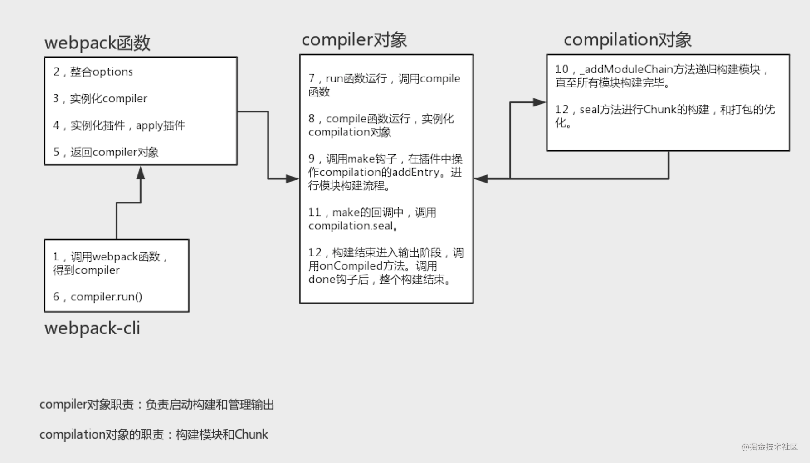

# Webpack 源码整体结构



解析 webpack 包进入`node_modules/webpack/bin/webpack.js`

```js
// 判断是否有安装webpack-cli、webpack-command包
const installedClis = CLIs.filter((cli) => cli.installed)

if (installedClis.length === 0) {
  // 1.没有安装webpack-cli、webpack-command这两个包，先提示错误信息需要安装webpack cli 然后指导用户安装
} else if (installedClis.length === 1) {
  // 2.安装了webpack-cli、webpack-command其中一个包
  const path = require("path")
  const pkgPath = require.resolve(`${installedClis[0].package}/package.json`)
  const pkg = require(pkgPath)
  require(path.resolve(
    //解析webpack-cli 或者 webpack-command 包
    path.dirname(pkgPath),
    pkg.bin[installedClis[0].binName]
  ))
} else {
  // 3.安装了webpack-cli、webpack-command这两个包，提示错误信息需要卸载其中一个包
}
```

解析 webpack-cli 包进入`node_modules/webpack-cli/package.json`

```json
{
  ...
  "bin": {
    "webpack-cli": "./bin/cli.js"
  },
  ...
}
```

实际上就是

```js
require("node_modules/webpack-cli/bin/cli.js")
```

解析 `node_modules/webpack-cli/bin/cli.js`

```js
// 存在webpack这个包
if (utils.packageExists("webpack")) {
  runCLI(process.argv, originalModuleCompile)
}
```

解析 `node_modules/webpack-cli/lib/bootstrap.js`

```js
const runCLI = async (args, originalModuleCompile) => {
  try {
    // 首先实例化WebpackCLI
    const cli = new WebpackCLI()
    cli._originalModuleCompile = originalModuleCompile
    // 然后调用上面的run方法
    await cli.run(args)
  } catch (error) {
    utils.logger.error(error)
    process.exit(2)
  }
}
```

解析 `node_modules/webpack-cli/lib/webpack-cli.js`拿到 WebpackCLI 实现 cli.run

```js
class WebpackCLI {
  constructor() {
    // 实例化WebpackCLI时，会解析webpack这个包
    this.webpack = require(process.env.WEBPACK_PACKAGE || "webpack")
  }
  // cli.run时会执行以下逻辑
  async run(args, parseOptions) {
    const loadCommandByName = async (commandName, allowToInstall = false) => {
      await this.runWebpack(options, isWatchCommandUsed)
    }
    this.program.action(async (options, program) => {
      await loadCommandByName(commandToRun, true)
    })
  }

  async runWebpack(options, isWatchCommand) {
    const callback = (error, stats) => {}
    compiler = await this.createCompiler(options, callback)
  }
  async createCompiler(options, callback) {
    this.applyNodeEnv(options)

    let config = await this.resolveConfig(options)

    config = await this.applyOptions(config, options)
    config = await this.applyCLIPlugin(config, options)

    let compiler

    compiler = this.webpack(config.options, callback)

    return compiler
  }
}
```

## 1.webpack

调用 webpack 函数，option 初始化，创建 compiler、compilation 对象、初始化 webpack 参数,得到 compiler,

实例化 WebpackCLI 时,解析`node_modules/webpack/lib/webpack.js`

```js
const webpack = (options, callback) => {
  let compiler
  if (Array.isArray(options)) {
  } else if (typeof options === "object") {
    // 用户设置的配置和默认配置合并
    options = new WebpackOptionsDefaulter().process(options)
    // Compiler 阶段
    compiler = new Compiler(options.context)
    compiler.options = options
    // 配置全局api插件
    new NodeEnvironmentPlugin({
      infrastructureLogging: options.infrastructureLogging,
    }).apply(compiler)
    // 执行我们在配置文件中配置的所有插件
    if (options.plugins && Array.isArray(options.plugins)) {
      for (const plugin of options.plugins) {
        if (typeof plugin === "function") {
          plugin.call(compiler, compiler)
        } else {
          plugin.apply(compiler)
        }
      }
    }
    compiler.hooks.environment.call()
    compiler.hooks.afterEnvironment.call()
    //开启默认的所有插件
    compiler.options = new WebpackOptionsApply().process(options, compiler)
  }
  return compiler
}
```

## 2.options

整合 options

```js
options = new WebpackOptionsDefaulter().process(options)
```

## 3.compiler

实例化 compiler

```js
compiler = new Compiler(options.context)
```

## 4.插件

实例化插件，apply 插件

```js
plugin.apply(compiler)
```

## 5.返回 compiler 对象

```js
compiler.hooks.environment.call()
compiler.hooks.afterEnvironment.call()
//开启默认的所有插件
compiler.options = new WebpackOptionsApply().process(options, compiler)
```

## 6.compiler.run()

解析 `node_modules/webpack-cli/lib/bootstrap.js`

```js
const runCLI = async (args, originalModuleCompile) => {
  ...
  await cli.run(args)
  ...
}
```

## 7.compile

开始编译，主要是加载入口文件，添加入口 module

run 函数运行，调用 compile 函数

./Compiler

```js
class Compiler extends Tapable {
  run(callback) {
      ...
    //编译完毕回调
    const onCompiled = (err, compilation) => {
      ...
    }

    this.hooks.beforeRun.callAsync(this, (err) => {
      this.compile(onCompiled)
    })
  }
  //编译
  compile(callback) {
    //创建编译器的参数
    const params = this.newCompilationParams()
    this.hooks.beforeCompile.callAsync(params, (err) => {
      if (err) return callback(err)

      this.hooks.compile.call(params)
      //创建一个编译器
      const compilation = this.newCompilation(params)
      //执行前面## EntryPlugin.js注册的make钩子函数并把编译器传递给插件
      this.hooks.make.callAsync(compilation, (err) => {
        if (err) return callback(err)

        compilation.finish((err) => {
          if (err) return callback(err)

          compilation.seal((err) => {
            if (err) return callback(err)

            this.hooks.afterCompile.callAsync(compilation, (err) => {
              if (err) return callback(err)

              return callback(null, compilation)
            })
          })
        })
      })
    })
  }
}
```

## 8.compilation

compile 函数运行，实例化 compilation 对象

```js
const compilation = this.newCompilation(params)
```

```js
newCompilation(params) {
  const compilation = this.createCompilation();
  compilation.fileTimestamps = this.fileTimestamps;
  compilation.contextTimestamps = this.contextTimestamps;
  compilation.name = this.name;
  compilation.records = this.records;
  compilation.compilationDependencies = params.compilationDependencies;
  this.hooks.thisCompilation.call(compilation, params);
  this.hooks.compilation.call(compilation, params);
  return compilation;
}
```

## 9.make

调用 make 钩子，在插件中操作 compilation 的 addEntry。进行模块构建流程。

```js
this.hooks.make.callAsync(compilation, (err) => {
  ...
})
```

```js
	createCompilation() {
		return new Compilation(this);
	}

	newCompilation(params) {
		const compilation = this.createCompilation();
		compilation.fileTimestamps = this.fileTimestamps;
		compilation.contextTimestamps = this.contextTimestamps;
		compilation.name = this.name;
		compilation.records = this.records;
		compilation.compilationDependencies = params.compilationDependencies;
		this.hooks.thisCompilation.call(compilation, params);
		this.hooks.compilation.call(compilation, params);
		return compilation;
	}
```

```js
addEntry(context, entry, name, callback) {

  this.hooks.addEntry.call(entry, name);

  const slot = {
    name: name,
    // TODO webpack 5 remove `request`
    request: null,
    module: null
  };

  if (entry instanceof ModuleDependency) {
    slot.request = entry.request;
  }

  // TODO webpack 5: merge modules instead when multiple entry modules are supported
  const idx = this._preparedEntrypoints.findIndex(slot => slot.name === name);
  if (idx >= 0) {
    // Overwrite existing entrypoint
    this._preparedEntrypoints[idx] = slot;
  } else {
    this._preparedEntrypoints.push(slot);
  }
  this._addModuleChain(
    context,
    entry,
    module => {
      this.entries.push(module);
    },
    (err, module) => {
      if (err) {
        this.hooks.failedEntry.call(entry, name, err);
        return callback(err);
      }

      if (module) {
        slot.module = module;
      } else {
        const idx = this._preparedEntrypoints.indexOf(slot);
        if (idx >= 0) {
          this._preparedEntrypoints.splice(idx, 1);
        }
      }
      this.hooks.succeedEntry.call(entry, name, module);
      return callback(null, module);
    }
  );
}
```

## 10.`_addModuleChain`

`_addModuleChain` 方法递归构建模块，直至所有模块构建完毕。

```js
	_addModuleChain(context, dependency, onModule, callback) {
		const start = this.profile && Date.now();
		const currentProfile = this.profile && {};

		const errorAndCallback = this.bail
			? err => {
					callback(err);
			  }
			: err => {
					err.dependencies = [dependency];
					this.errors.push(err);
					callback();
			  };

		if (
			typeof dependency !== "object" ||
			dependency === null ||
			!dependency.constructor
		) {
			throw new Error("Parameter 'dependency' must be a Dependency");
		}
		const Dep = /** @type {DepConstructor} */ (dependency.constructor);
		const moduleFactory = this.dependencyFactories.get(Dep);
		if (!moduleFactory) {
			throw new Error(
				`No dependency factory available for this dependency type: ${dependency.constructor.name}`
			);
		}

		this.semaphore.acquire(() => {
			moduleFactory.create(
				{
					contextInfo: {
						issuer: "",
						compiler: this.compiler.name
					},
					context: context,
					dependencies: [dependency]
				},
				(err, module) => {
					if (err) {
						this.semaphore.release();
						return errorAndCallback(new EntryModuleNotFoundError(err));
					}

					let afterFactory;

					if (currentProfile) {
						afterFactory = Date.now();
						currentProfile.factory = afterFactory - start;
					}

					const addModuleResult = this.addModule(module);
					module = addModuleResult.module;

					onModule(module);

					dependency.module = module;
					module.addReason(null, dependency);

					const afterBuild = () => {
						if (addModuleResult.dependencies) {
							this.processModuleDependencies(module, err => {
								if (err) return callback(err);
								callback(null, module);
							});
						} else {
							return callback(null, module);
						}
					};

					if (addModuleResult.issuer) {
						if (currentProfile) {
							module.profile = currentProfile;
						}
					}

					if (addModuleResult.build) {
						this.buildModule(module, false, null, null, err => {
							if (err) {
								this.semaphore.release();
								return errorAndCallback(err);
							}

							if (currentProfile) {
								const afterBuilding = Date.now();
								currentProfile.building = afterBuilding - afterFactory;
							}

							this.semaphore.release();
							afterBuild();
						});
					} else {
						this.semaphore.release();
						this.waitForBuildingFinished(module, afterBuild);
					}
				}
			);
		});
	}
```

## 11.seal

make 的回调中，调用 compilation.seal。

```js
compilation.seal((err) => {
  if (err) return callback(err)

  this.hooks.afterCompile.callAsync(compilation, (err) => {
    if (err) return callback(err)

    return callback(null, compilation)
  })
})
```

## 12.Chunk

seal 方法进行 Chunk 的构建，和大包优化。

```js
	seal(callback) {
		this.hooks.seal.call();

		while (
			this.hooks.optimizeDependenciesBasic.call(this.modules) ||
			this.hooks.optimizeDependencies.call(this.modules) ||
			this.hooks.optimizeDependenciesAdvanced.call(this.modules)
		) {
			/* empty */
		}
		this.hooks.afterOptimizeDependencies.call(this.modules);

		this.hooks.beforeChunks.call();
		for (const preparedEntrypoint of this._preparedEntrypoints) {
			const module = preparedEntrypoint.module;
			const name = preparedEntrypoint.name;
			const chunk = this.addChunk(name);
			const entrypoint = new Entrypoint(name);
			entrypoint.setRuntimeChunk(chunk);
			entrypoint.addOrigin(null, name, preparedEntrypoint.request);
			this.namedChunkGroups.set(name, entrypoint);
			this.entrypoints.set(name, entrypoint);
			this.chunkGroups.push(entrypoint);

			GraphHelpers.connectChunkGroupAndChunk(entrypoint, chunk);
			GraphHelpers.connectChunkAndModule(chunk, module);

			chunk.entryModule = module;
			chunk.name = name;

			this.assignDepth(module);
		}
		buildChunkGraph(
			this,
			/** @type {Entrypoint[]} */ (this.chunkGroups.slice())
		);
		this.sortModules(this.modules);
		this.hooks.afterChunks.call(this.chunks);

		this.hooks.optimize.call();

		while (
			this.hooks.optimizeModulesBasic.call(this.modules) ||
			this.hooks.optimizeModules.call(this.modules) ||
			this.hooks.optimizeModulesAdvanced.call(this.modules)
		) {
			/* empty */
		}
		this.hooks.afterOptimizeModules.call(this.modules);

		while (
			this.hooks.optimizeChunksBasic.call(this.chunks, this.chunkGroups) ||
			this.hooks.optimizeChunks.call(this.chunks, this.chunkGroups) ||
			this.hooks.optimizeChunksAdvanced.call(this.chunks, this.chunkGroups)
		) {
			/* empty */
		}
		this.hooks.afterOptimizeChunks.call(this.chunks, this.chunkGroups);

		this.hooks.optimizeTree.callAsync(this.chunks, this.modules, err => {
			if (err) {
				return callback(err);
			}

			this.hooks.afterOptimizeTree.call(this.chunks, this.modules);

			while (
				this.hooks.optimizeChunkModulesBasic.call(this.chunks, this.modules) ||
				this.hooks.optimizeChunkModules.call(this.chunks, this.modules) ||
				this.hooks.optimizeChunkModulesAdvanced.call(this.chunks, this.modules)
			) {
				/* empty */
			}
			this.hooks.afterOptimizeChunkModules.call(this.chunks, this.modules);

			const shouldRecord = this.hooks.shouldRecord.call() !== false;

			this.hooks.reviveModules.call(this.modules, this.records);
			this.hooks.optimizeModuleOrder.call(this.modules);
			this.hooks.advancedOptimizeModuleOrder.call(this.modules);
			this.hooks.beforeModuleIds.call(this.modules);
			this.hooks.moduleIds.call(this.modules);
			this.applyModuleIds();
			this.hooks.optimizeModuleIds.call(this.modules);
			this.hooks.afterOptimizeModuleIds.call(this.modules);

			this.sortItemsWithModuleIds();

			this.hooks.reviveChunks.call(this.chunks, this.records);
			this.hooks.optimizeChunkOrder.call(this.chunks);
			this.hooks.beforeChunkIds.call(this.chunks);
			this.applyChunkIds();
			this.hooks.optimizeChunkIds.call(this.chunks);
			this.hooks.afterOptimizeChunkIds.call(this.chunks);

			this.sortItemsWithChunkIds();

			if (shouldRecord) {
				this.hooks.recordModules.call(this.modules, this.records);
				this.hooks.recordChunks.call(this.chunks, this.records);
			}

			this.hooks.beforeHash.call();
			this.createHash();
			this.hooks.afterHash.call();

			if (shouldRecord) {
				this.hooks.recordHash.call(this.records);
			}

			this.hooks.beforeModuleAssets.call();
			this.createModuleAssets();
			if (this.hooks.shouldGenerateChunkAssets.call() !== false) {
				this.hooks.beforeChunkAssets.call();
				this.createChunkAssets();
			}
			this.hooks.additionalChunkAssets.call(this.chunks);
			this.summarizeDependencies();
			if (shouldRecord) {
				this.hooks.record.call(this, this.records);
			}

			this.hooks.additionalAssets.callAsync(err => {
				if (err) {
					return callback(err);
				}
				this.hooks.optimizeChunkAssets.callAsync(this.chunks, err => {
					if (err) {
						return callback(err);
					}
					this.hooks.afterOptimizeChunkAssets.call(this.chunks);
					this.hooks.optimizeAssets.callAsync(this.assets, err => {
						if (err) {
							return callback(err);
						}
						this.hooks.afterOptimizeAssets.call(this.assets);
						if (this.hooks.needAdditionalSeal.call()) {
							this.unseal();
							return this.seal(callback);
						}
						return this.hooks.afterSeal.callAsync(callback);
					});
				});
			});
		});
	}
```

## 13.onCompiled

构建结束进入输出阶段，调用 onCompiled 方法。调用 done 钩子后，整个构建结束。

```js
const onCompiled = (err, compilation) => {
  if (err) return finalCallback(err)

  if (this.hooks.shouldEmit.call(compilation) === false) {
    const stats = new Stats(compilation)
    stats.startTime = startTime
    stats.endTime = Date.now()
    this.hooks.done.callAsync(stats, (err) => {
      if (err) return finalCallback(err)
      return finalCallback(null, stats)
    })
    return
  }
  //执行打包操作
  this.emitAssets(compilation, (err) => {
    if (err) return finalCallback(err)

    if (compilation.hooks.needAdditionalPass.call()) {
      compilation.needAdditionalPass = true

      const stats = new Stats(compilation)
      stats.startTime = startTime
      stats.endTime = Date.now()
      this.hooks.done.callAsync(stats, (err) => {
        if (err) return finalCallback(err)

        this.hooks.additionalPass.callAsync((err) => {
          if (err) return finalCallback(err)
          this.compile(onCompiled)
        })
      })
      return
    }

    this.emitRecords((err) => {
      if (err) return finalCallback(err)

      const stats = new Stats(compilation)
      stats.startTime = startTime
      stats.endTime = Date.now()
      this.hooks.done.callAsync(stats, (err) => {
        if (err) return finalCallback(err)
        return finalCallback(null, stats)
      })
    })
  })
}
```
